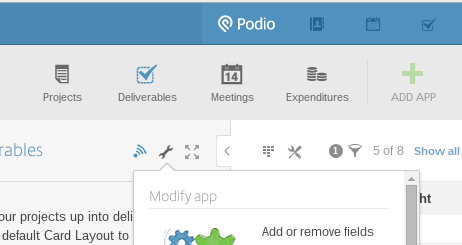
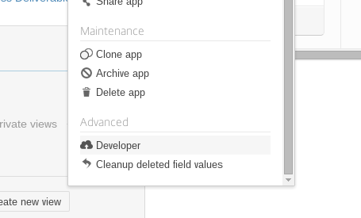
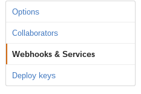
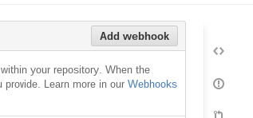
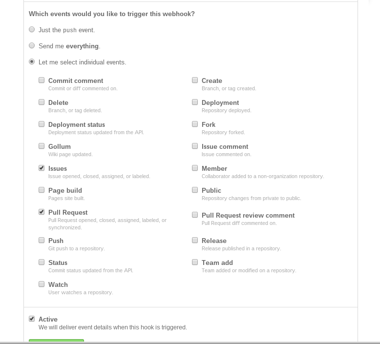

## Github => Podio

To start, go to the App you want to post to on Podio, then "Settings" > "Developer".

Copy the Application ID and Application Token and paste them below. On any Item in the application
that you want to receive updates, add a tag to denote the repository to accept updates from.

    github:octocat/Spoon-Knife

If you want to further filter issues, optionally add any additional tags you want to match on.
If you don't want Podio to launch a notification, check the "Silent" box. Then hit Submit.

You'll get back a custom URL to respond to GitHub events. Copy this URL, go into the settings menu
for your repository on GitHub, select "Webhooks and Services" and then "Add Webhook".

 

Paste the URL into "Payload URL" and keep the Content type as "application/json". Select
"Let me select individual events." and check the boxes for "Issues" and "Pull Requests"
(or just one if you only want one of these). Click "Activate".

Now you should start receiving notifications in Podio!